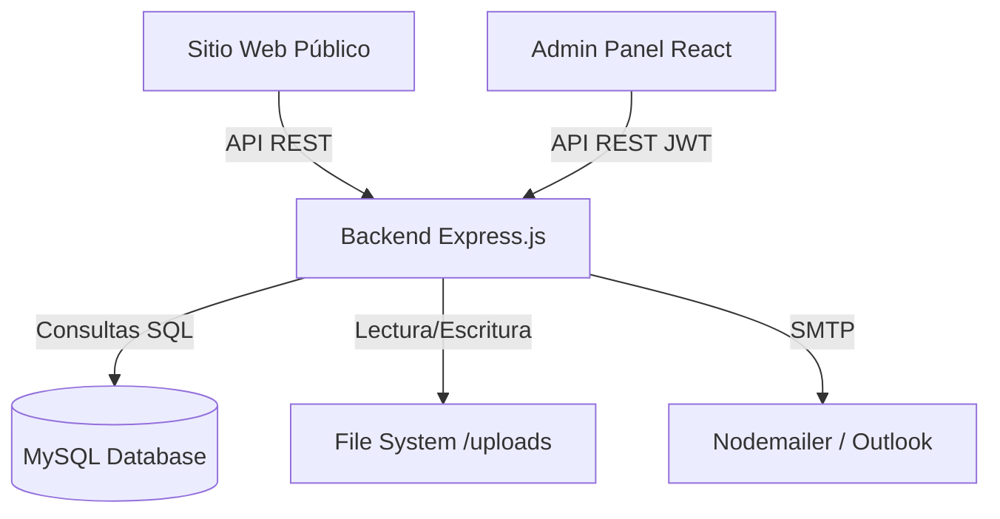
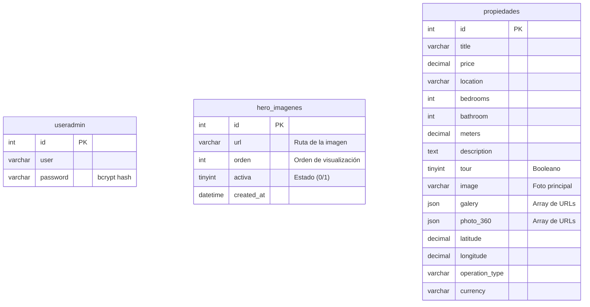

# 🏢 MARBAS Propiedades - Sistema de Gestión Inmobiliaria


Sistema integral Full-Stack diseñado para la gestión y publicación de propiedades de la inmobiliaria MARBAS (General Roca, Río Negro). 
Este repositorio funciona como un **Monorepo** que consolida el Backend (API RESTful), el Panel de Administración (React/Vite) y el Sitio Web Público (Vanilla JS/CSS).

---

## 🏗 Arquitectura del Sistema



## 🚀 Tecnologías Principales

### Backend (Core API)
- **Node.js & Express:** Servidor robusto y escalable.
- **MySQL2 (con Connection Pool):** Persistencia de datos de alto rendimiento.
- **Seguridad:** JWT (Access & Refresh tokens), bcrypt, Helmet, CORS restrictivo, Express Rate Limit.
- **Gestión de Archivos:** Multer (con validación estricta de MIME types y size limits).
- **Notificaciones:** Nodemailer para gestión de contactos entrantes.

### Panel de Administración (Admin Panel)
- **React.js & Vite:** SPA ultra rápida para la gestión de inventario.
- **Tailwind CSS:** Diseño responsivo y moderno.
- **Axios:** Cliente HTTP con interceptores para inyección de tokens automáticos.

### Sitio Público
- **Vanilla HTML/CSS/JS:** Optimizado para SEO, carga rápida y compatibilidad universal.
- **Integración dinámica:** Consumo de la API mediante Fetch para hidratar el DOM.

---

## 📂 Estructura del Monorepo

```text
MARBAS-Inmobiliaria/
├── admin-panel/        # SPA en React/Vite para administradores (Gestión CRUD)
├── config/             # Configuración del Backend (DB, Multer, etc.)
├── controllers/        # Lógica de negocio de los endpoints de la API
├── docs/               # Documentación y diagramas
├── frontend/           # Archivos estáticos del sitio web público al cliente
├── middlewares/        # Middlewares (Auth, ErrorHandler, Validadores)
├── routes/             # Definición de rutas Express
├── uploads/            # Volumen de almacenamiento de imágenes y tours 360
├── utils/              # Funciones de ayuda (CatchAsync, Sanitizadores, AppError)
└── server.js           # Punto de entrada del Backend
```

---

## 🛠 Instalación y Entorno de Desarrollo Local

### 1. Requisitos Previos
- Node.js (v18 o superior)
- MySQL Server (v8 o superior) ejecutándose en puerto 3306

### 2. Configuración del Backend
```bash
# Instalar dependencias del backend
npm install

# Iniciar el servidor en modo desarrollo
npm run dev
# (O alternativamente: node server.js)
```

### 3. Configuración del Panel de Administración
```bash
cd admin-panel
# Instalar dependencias del frontend
npm install

# Iniciar el servidor de desarrollo de Vite
npm run dev
```

---

## 🔐 Variables de Entorno (`.env`)

El sistema utiliza el paradigma *Fail-Fast* durante el arranque. Si falta una variable crítica, el proceso documentará el error y abortará la ejecución.

```env
# Configuración del Servidor
PORT=3000
NODE_ENV=development
ALLOWED_ORIGINS=http://localhost:3000,http://localhost:5173

# Base de Datos MySQL
DB_HOST=localhost
DB_USER=root
DB_PASSWORD=
DB_NAME=marbas

# Seguridad y Autenticación JWT
JWT_SECRET=tu_clave_secreta_super_fuerte
JWT_EXPIRE=2h
JWT_REFRESH_SECRET=tu_clave_secreta_para_refrescar
JWT_REFRESH_EXPIRE=7d

# Configuración de Archivos y Rate Limiting
MAX_FILE_SIZE=10485760 # 10MB
RATE_LIMIT_WINDOW=15
RATE_LIMIT_MAX_REQUESTS=100

# Credenciales SMTP (Contacto)
EMAIL_USER=tu_correo@outlook.com
EMAIL_PASSWORD=tu_contrasena_de_aplicacion
EMAIL_FROM=MARBAS <tu_correo@outlook.com>
```

---

## 🗄 Esquema de Base de Datos (ERD)



---

## 🛡 Seguridad Aplicada

Como Ingenieros de Software, diseñamos el sistema aplicando el principio de **Defensa en Profundidad (Defense in Depth)**:

1. **Protección a Nivel de Red / Transporte:**
   - CORS restrictivo configurado mediante whitelist (`ALLOWED_ORIGINS`).
   - Cabeceras de seguridad inyectadas vía `Helmet`.
   
2. **Protección a Nivel de Aplicación:**
   - Limitador de peticiones (`express-rate-limit`) para mitigar ataques DDoS y fuerza bruta en endpoints críticos (Login, Contacto).
   - Sanitización de Entradas (`validator`) para prevenir inyecciones SQL y XSS.
   - Manejador de Errores Centralizado: Evita la fuga de información sensible (Stack Traces) en producción.

3. **Autenticación y Sesión:**
   - Esquema Dual de Tokens: Access Token de corta duración (2h) y Refresh Token en frío (7d).
   - Contraseñas protegidas mediante Hash iterativo (Bcrypt).

4. **Sistema de Archivos Seguro:**
   - Los archivos subidos se validan en memoria mediante `Multer` (MIME-Type spoofing prevention) antes de tocar el disco.
   - Nombres de archivo ofuscados y saneados con timestamps + random hashes para evitar colisiones de nombres o ejecución remota (Directory Traversal).

---

## 🚀 Despliegue en Producción (Guía Rápida)

Para entornos productivos, se recomienda utilizar **PM2** como gestor de procesos y **Nginx** como Proxy Inverso.

### 1. Iniciar el servicio con PM2
```bash
npm install -g pm2
pm2 start server.js --name "marbas-api" --env production
pm2 save
pm2 startup
```

### 2. Configurar Nginx (Proxy y Archivos Estáticos)
```nginx
server {
    listen 80;
    server_name marbaspropiedades.com.ar;

    # Frontend Público
    location / {
        root /var/www/marbas/frontend;
        index index.html;
        try_files $uri $uri/ /index.html;
    }

    # Proxy a la API de Node.js
    location /api/ {
        proxy_pass http://localhost:3000;
        proxy_http_version 1.1;
        proxy_set_header Upgrade $http_upgrade;
        proxy_set_header Connection 'upgrade';
        proxy_set_header Host $host;
        proxy_cache_bypass $http_upgrade;
    }

    # Archivos subidos (Imágenes)
    location /uploads/ {
        alias /var/www/marbas/uploads/;
        expires 30d;
        add_header Cache-Control "public, max-age=2592000";
    }
}
```
